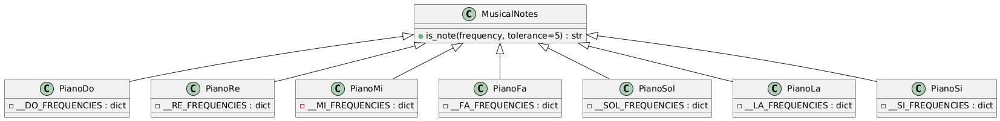
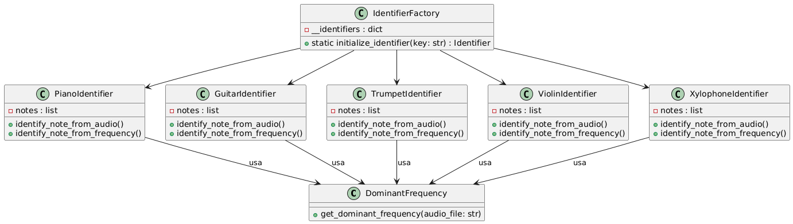
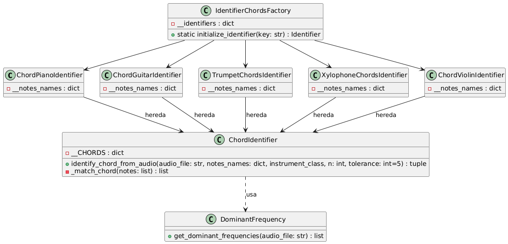

# Práctica 4: Procesamiento de audio.

Integrantes:
- Gerardo León Quintana
- Susana Suárez Mendoza

## Ejercicio 1:

Construir un identificador de notas musicales. Es decir; en su versión más sencilla (y suficiente) la entrada es un sonido con una sola nota musical y debe identificar cuál es. Por simplicidad elija un único instrumento para la identificación. 

Este ejercicio tiene como objetivo desarrollar un sistema de programación que simule las notas musicales de diversos instrumentos. Los instrumentos considerados son los siguientes: piano, trompeta, guitarra, violín y xilófono. La implementación se ha realizado a través de módulos y clases, los cuales se describen en detalle a continuación.

- `/musical_notes`: Este módulo contiene las clases correspondientes a cada instrumento, en las que se definen las frecuencias de las notas musicales y sus respectivas octavas. En la Figura 1 se presenta el diagrama de clases para el instrumento piano, como ejemplo representativo. Las notas sostenidas han sido omitidas en el diagrama para mejorar la legibilidad. Sin embargo, la estructura para los demás instrumentos sigue el mismo esquema, variando únicamente en las frecuencias específicas de cada nota, acorde al instrumento y a la octava correspondiente.

  
    
<strong>Figura 1.</strong> Diagrama de clases para las notas musicales del piano.
 

- `/identifiers`: Este módulo contiene los distintos submódulos para identificar una única nota, otro para identificar acordes y otro para identificar notas a lo largo del tiempo e intentar aproximar la partitura del sonido.
  - `/single_notes`: Este submódulo contiene una clase principal que implementa el *factory method* el cual es un patrón de diseño creacional que define una interfaz para crear objetos en una superclase, pero permite a las subclases alterar el tipo de objeto que se creará. Con ello, se consigue que solo dando el nombre del instrumento, se te cree el objeto de la clase de ese tipo. Destacar que para conocer en profundidad los parámetros y devoluciones de cada método se debe observar el código.
 
  

    
      
<strong>Figura 2.</strong> Diagrama de clases para la identificación de una nota.
 
  

  - `/chords`: Este submódulo contiene las clases necesarias para identificar y/o aproximar los acordes de un archivo de audio con un único acorde. Al igual que el anterior, esta compuesto por una clase que implementa el *factory method*. Además dispone de una clase que contiene todos los acordes y sus notas correspondientes de la cual heredan los identificadores de acordes de cada intrumento.
 
  

    
      
<strong>Figura 2.</strong> Diagrama de clases para la identificación de acordes. 
 
  

  - `/scales`: Este submódulo contiene las clases necesarias paea iddentificar notas en un intervalo de tiempo únicamente para el piano y la guitarra debido a su simplicidad.
