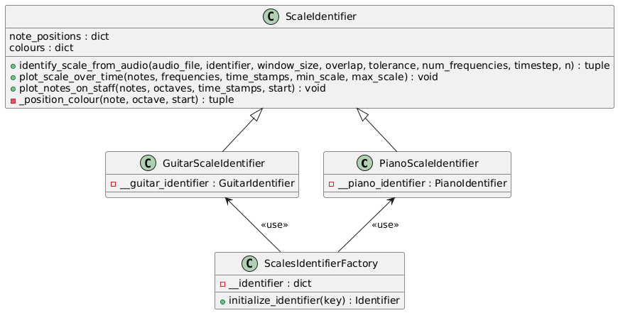
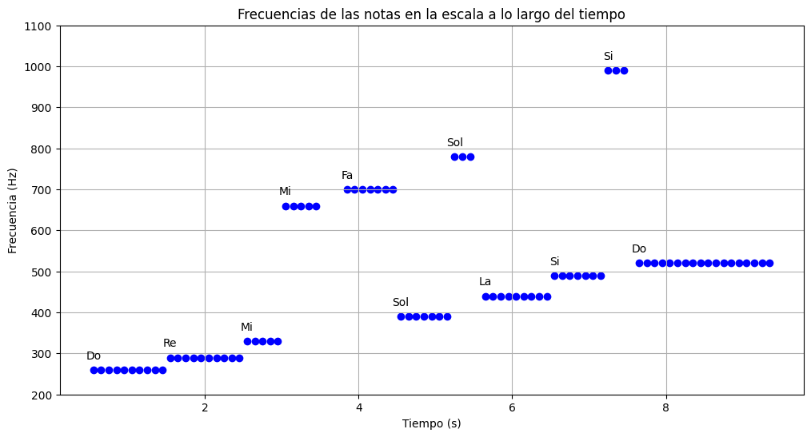
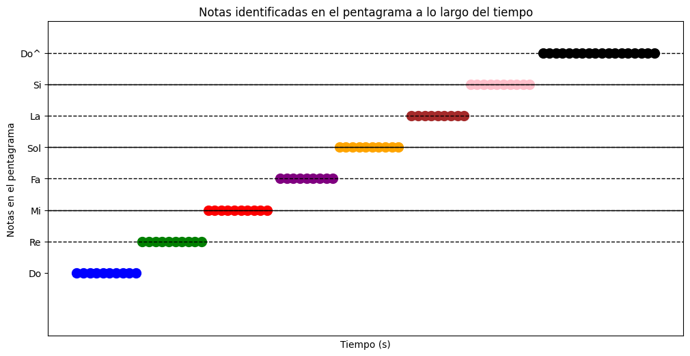
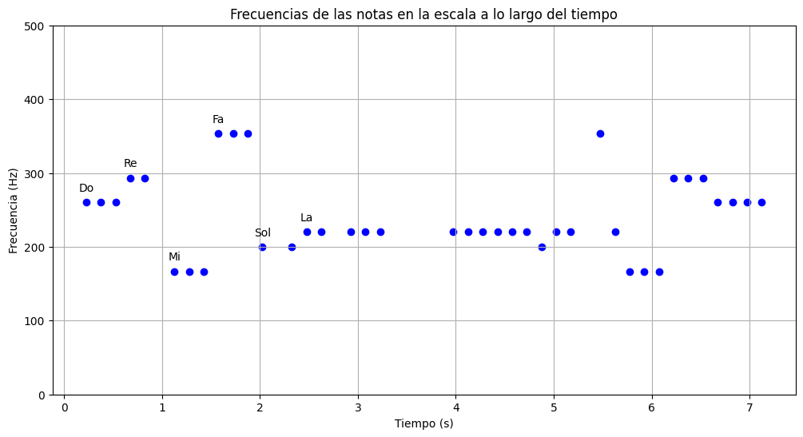
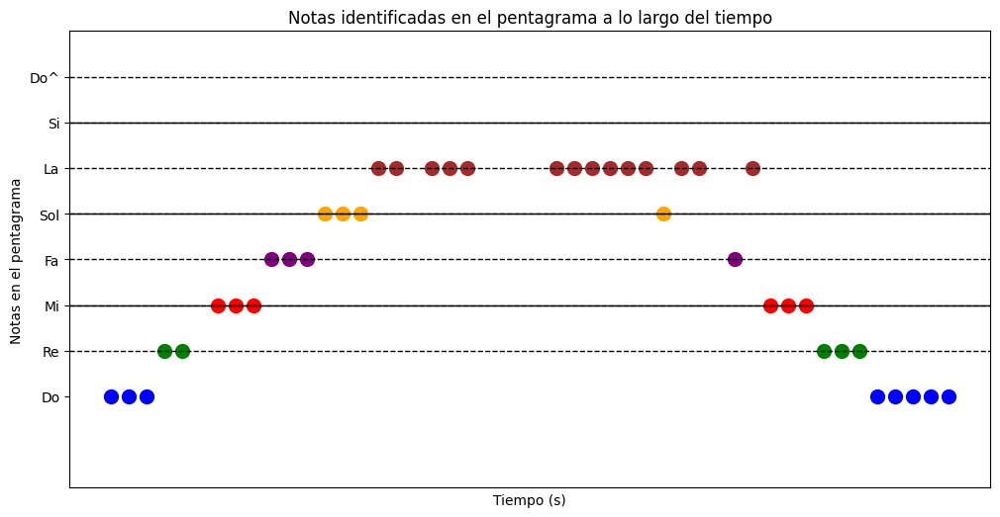

# Práctica 4: Procesamiento de audio.

Integrantes:
- Gerardo León Quintana
- Susana Suárez Mendoza

## Ejercicio 1:

Construir un identificador de notas musicales. Es decir; en su versión más sencilla (y suficiente) la entrada es un sonido con una sola nota musical y debe identificar cuál es. Por simplicidad elija un único instrumento para la identificación. 

Este ejercicio tiene como objetivo desarrollar un sistema de programación que simule las notas musicales de diversos instrumentos. Los instrumentos considerados son los siguientes: piano, trompeta, guitarra, violín y xilófono.

### 1. Implementación de intrumentos y acordes

 La implementación se ha realizado a través de módulos y clases, los cuales se describen en detalle a continuación.
 
- `/musical_notes`: Este módulo contiene las clases correspondientes a cada instrumento, en las que se definen las frecuencias de las notas musicales y sus respectivas octavas. En la Figura 1 se presenta el diagrama de clases para el instrumento piano, como ejemplo representativo. Las notas sostenidas han sido omitidas en el diagrama para mejorar la legibilidad. Sin embargo, la estructura para los demás instrumentos sigue el mismo esquema, variando únicamente en las frecuencias específicas de cada nota, acorde al instrumento y a la octava correspondiente.


  <div align="center">
    
      <p><strong>Figura 1.</strong> Diagrama de clases para las notas musicales del piano.</p> 
  </div>

- `/identifiers`: Este módulo agrupa los submódulos diseñados para identificar diversos aspectos de una señal de audio, como notas individuales, acordes, y secuencias de notas a lo largo del tiempo con el fin de aproximar la partitura del sonido.
  - `/single_notes`: Este submódulo implementa la identificación de una nota musical en función del instrumento. Contiene una clase principal que sigue el patrón de diseño creacional *Factory Method*. Este patrón define una interfaz para la creación de objetos en una superclase, pero permite que las subclases definan el tipo específico de objeto que será creado. En este contexto, el patrón facilita la creación de un identificador de nota basado en el instrumento, proporcionando simplemente el nombre del mismo. Para obtener más detalles sobre los parámetros y las devoluciones de los métodos, se debe consultar el código fuente.

  <div align="center">
      
        <p><strong>Figura 2.</strong> Diagrama de clases para la identificación de una nota.</p> 
  </div>

  - `/chords`: Este submódulo contiene las clases necesarias para identificar o aproximar los acordes de un archivo de audio que contiene un único acorde. Al igual que el submódulo anterior, utiliza una clase que implementa el patrón *Factory Method*. Además, cuenta con una clase que define todos los acordes y sus notas correspondientes, de la cual heredan los identificadores de acordes para cada instrumento. Esto facilita la expansión del sistema con nuevos instrumentos sin necesidad de modificar el código existente.
 
    <div align="center">
      
        <p><strong>Figura 3.</strong> Diagrama de clases para la identificación de acordes. </p> 
    </div>

  - `/scales`: Este submódulo se encarga de identificar notas a lo largo de un intervalo de tiempo $t$, específicamente para instrumentos como el piano y la guitarra, debido a la simplicidad de su estructura. El objetivo es extraer y analizar secuencias de notas a lo largo del tiempo para aproximar la escala o partitura del audio analizado.
 
    <div align="center">
      
        <p><strong>Figura 4.</strong> Diagrama de clases para la identificación de notas musicales a lo largo del tiempo. </p> 
    </div>

- `dominant_frequency.py`: Esta clase es la pieza central del proyecto, ya que es responsable de realizar las Transformadas de Fourier necesarias para extraer las frecuencias dominantes de la señal de audio. Sus principales métodos se describen a continuación: 

```python
# Calcula la Transformada de Fuorier y devuelve las frecuencias fundamentales
def _get_frequencies(sr, data):
  ...
  return fourier,freqs

# Devuelve la frecuencia de mayor magnitud
def get_dominant_frequency(audio_file):
  ...
  return freqs[np.argmax(fourier)]

# Identifica las n frecuencias dominantes en un archivo de audio
get_dominant_frequencies(audio_file, num_frequencies=3, min_distance=5):
  ...
  return dominant_frequencies
```

### 2. Notebook de presentación

El notebook titulado `Ejercicio_1.ipynb` está diseñado para procesar y analizar audios de prueba almacenados en la carpeta `/audios`. Estos audios se obtuvieron de la página [freesound](https://freesound.org/), que ofrece una variedad de sonidos de libre disposición para estudios y proyectos. El archivo se organiza en tres secciones principales, que se describen a continuación:

1. **Identificación de una única nota en diversos instrumentos**: Esta sección realiza la identificación de notas y octavas en una selección de instrumentos: piano, guitarra, trompeta, violín y xilófono. Cada archivo de audio contiene una única nota de uno de estos instrumentos, con un conjunto adicional que abarca la mayoría de las notas, todas debidamente etiquetadas para simplificar el análisis y la clasificación. La función principal de esta parte del programa es detectar y clasificar las diferentes notas y sus octavas. Un ejemplo de esta identificación se presenta en la **Tabla 1**, que incluye el nombre del archivo, la nota identificada, la octava y la frecuencia correspondiente al instrumento del piano.

<div align="center">
  
 | Archivo         | Nota Identificada   | Octava | Frecuencia   |
 |-----------------|---------------------|:------:|:------------:|
 | do_piano.wav    | Do                  |   5    | 523.370840   |
 | do_reb.wav      | DoSostenidoReb      |   5    | 558.260716   |
 | fa_piano.wav    | Fa                  |   4    | 348.570527   |
 | fa_solb.wav     | FaSostenidoSolb     |   5    | 745.862282   |
 | la_piano.wav    | La                  |   4    | 439.079029   |
 | la_sib.wav      | LaSostenidoSib      |   4    | 469.328486   |
 | mi_piano.wav    | Mi                  |   4    | 329.206744   |
 | re_mib.wav      | ReSostenidoMib      |   5    | 627.069595   |
 | re_piano.wav    | Re                  |   4    | 291.513399   |
 | si_piano.wav    | Si                  |   4    | 494.372433   |
 | sol_lab.wav     | SolSostenidoLab     |   4    | 418.046397   |
 | sol_piano.wav   | Sol                 |   4    | 389.756715   |
 
 <b>Tabla 1:</b> Información de archivos de audio con notas y frecuencias del piano.
</div>

Esta tabla muestra la precisión con la que el programa puede identificar tanto las notas como las octavas, junto con sus respectivas frecuencias.

2. **Identificación de acordes tríada en diversos instrumentos**: Un **acorde** es una combinación armónica de tres o más notas que se tocan simultáneamente, añadiendo color y profundidad a la música. La estructura de un acorde depende de los intervalos, o distancias, entre las notas, y según la combinación de estos intervalos, el acorde puede tener diferentes cualidades (mayores, menores, disminuidos, aumentados, entre otros). Para este análisis, se han elegido **acordes tríada**, los cuales constituyen la forma más básica de acordes y están compuestos por tres notas específicas: la tónica (nota base), la tercera (que puede ser mayor o menor) y la quinta (que puede ser justa, disminuida o aumentada). La combinación de estas notas define el carácter y la cualidad del acorde. La **Tabla 2** muestra ejemplos de identificación de acordes en archivos de audio del piano.

<div align="center">

|   | Archivo                    | Acorde Identificado              | Acorde Real                            | Frecuencias             |
|---|----------------------------|----------------------------------|----------------------------------------|--------------------------|
| 0 | do_mayor.wav               | Do Mayor                        | Do-Mi-Sol                              | [392.17, 330.0, 261.5]   |
| 1 | do_menor.wav               | Do Menor (Cm)                   | Do-ReSostenidoMib-Sol                  | [311.32, 261.66, 392.24] |
| 2 | do_sostenido_mayor.wav     | Do Sostenido Mayor (C#)         | DoSostenidoReb-Fa-SolSostenidoLab      | [415.5, 277.0, 349.33]   |
| 3 | do_sostenido_menor.wav     | Do Sostenido Menor (C#m)        | DoSostenidoReb-Mi-SolSostenidoLab      | [415.5, 277.0, 330.0]    |
| 4 | fa_mayor.wav               | Fa Mayor                        | Fa-La-Do                               | [349.33, 523.5, 440.33]  |
| 5 | fa_menor.wav               | Fa Menor (Fm)                   | Fa-SolSostenidoLab-Do                  | [415.5, 349.33, 523.5]   |
| 6 | fa_sostenido_mayor.wav     | Fa Sostenido Mayor (F#)         | FaSostenidoSolb-LaSostenidoSib-DoSostenidoReb | [466.33, 554.5, 370.17] |
| 7 | fa_sostenido_menor.wav     | Fa Sostenido Menor (F#m)        | FaSostenidoSolb-La-DoSostenidoReb      | [554.5, 370.17, 440.33]  |
| 8 | la_mayor.wav               | La Mayor                        | La-DoSostenidoReb-Mi                   | [554.5, 440.33, 660.17]  |
| 9 | la_menor.wav               | La Menor (Am)                   | La-Do-Mi                               | [523.5, 440.33, 660.17]  |
| 10| la_sostenido_mayor.wav     | La Sostenido Mayor (A#)         | LaSostenidoSib-Re-Fa                   | [466.33, 587.83, 699.33] |
| 11| la_sostenido_menor.wav     | La Sostenido Menor (A#m)        | LaSostenidoSib-DoSostenidoReb-Fa       | [466.33, 554.5, 699.33]  |
| 12| mi_mayor.wav               | Mi Mayor                        | Mi-SolSostenidoLab-Si                  | [415.5, 494.33, 330.0]   |
| 13| mi_menor.wav               | Mi Menor (Em)                   | Mi-Sol-Si                              | [494.33, 392.17, 330.0]  |
| 14| re_mayor.wav               | Re Mayor                        | Re-FaSostenidoSolb-La                  | [370.17, 293.5, 440.33]  |
| 15| re_menor.wav               | Re Menor (Dm)                   | Re-Fa-La                               | [349.33, 293.5, 440.33]  |
| 16| re_sostenido_mayor.wav     | Re Sostenido Mayor (D#)         | ReSostenidoMib-Sol-LaSostenidoSib      | [392.17, 466.33, 311.0]  |
| 17| re_sostenido_menor.wav     | Re Sostenido Menor (D#m)        | ReSostenidoMib-FaSostenidoSolb-LaSostenidoSib | [466.33, 311.0, 370.17]  |
| 18| si_mayor.wav               | Si Mayor                        | Si-ReSostenidoMib-FaSostenidoSolb      | [494.33, 740.33, 623.17] |
| 19| si_menor.wav               | Si Menor (Bm)                   | Si-Re-FaSostenidoSolb                  | [494.33, 587.83, 740.33] |
| 20| sol_mayor.wav              | Sol Mayor                       | Sol-Si-Re                              | [494.33, 392.17, 587.83] |
| 21| sol_menor.wav              | Sol Menor (Gm)                  | Sol-LaSostenidoSib-Re                  | [392.17, 466.33, 587.83] |
| 22| sol_sostenido_mayor.wav    | Sol Sostenido Mayor (G#)        | SolSostenidoLab-Do-ReSostenidoMib      | [415.5, 523.5, 1246.33]  |
| 23| sol_sostenido_menor.wav    | Sol Sostenido Menor (G#m)       | SolSostenidoLab-Si-ReSostenidoMib      | [415.5, 494.33, 623.17]  |

 <b>Tabla 2:</b> Información de archivos de audio con acordes del piano.
</div>

En algunos casos, como en la guitarra, la identificación del acorde puede presentar dificultades. Sin embargo, el sistema logra identificar al menos dos de las tres notas, lo que permite aproximar el acorde y sugiere dos posibles resultados, como se observa en las **Tablas 3** y **4**.

<div align="center">
 
|   | Archivo                | Acorde Identificado            | Acorde Real                          | Frecuencias             |
|---|------------------------|--------------------------------|--------------------------------------|--------------------------|
| 0 | do_mayor.wav           | Do Mayor                      | Do-Mi-Sol                            | [131.08, 329.31, 393.54]|
| 1 | do_sostenido_mayor.wav | Do Sostenido Mayor (C#)       | DoSostenidoReb-Fa-SolSostenidoLab    | [349.88, 277.85, 205.89]|
| 2 | la_menor.wav           | La Menor (Am)                 | La-Do-Mi                             | [221.77, 330.51, 262.29]|
| 3 | mi_menor.wav           | Mi Menor (Em)                 | Mi-Sol-Si                            | [247.62, 164.29, 197.02]|
| 4 | sol_mayor.wav          | Sol Mayor                     | Sol-Si-Re                            | [146.2, 123.1, 197.3]   |

 <b>Tabla 3:</b> Información de archivos de audio con acordes de la guitarra.
</div>

<div align="center">
 
|   | Archivo                        | Acorde Identificado          | Acorde Real                            | Notas Identificadas            | Frecuencias             |
|---|--------------------------------|------------------------------|----------------------------------------|---------------------------------|--------------------------|
| 0 | do_menor-sol_sost_mayor.wav    | Do Menor (Cm)               | Do-ReSostenidoMib-Sol                  | ReSostenidoMib-Do               | [154.64, 130.09, 260.34] |
| 1 | do_menor-sol_sost_mayor.wav    | Sol Sostenido Mayor (G#)    | SolSostenidoLab-Do-ReSostenidoMib      | ReSostenidoMib-Do               | [154.64, 130.09, 260.34] |
| 2 | fa_menor-do_sost_mayor.wav     | Do Sostenido Mayor (C#)     | DoSostenidoReb-Fa-SolSostenidoLab      | SolSostenidoLab-Fa              | [415.86, 348.75, 208.13] |
| 3 | fa_menor-do_sost_mayor.wav     | Fa Menor (Fm)               | Fa-SolSostenidoLab-Do                  | SolSostenidoLab-Fa              | [415.86, 348.75, 208.13] |
| 4 | mi_mayor-menor.wav             | Mi Mayor                    | Mi-SolSostenidoLab-Si                  | Si-Mi                           | [123.86, 328.6, 371.75]  |
| 5 | mi_mayor-menor.wav             | Mi Menor (Em)               | Mi-Sol-Si                              | Si-Mi                           | [123.86, 328.6, 371.75]  |
| 6 | mi_mayor-menor.wav             | Si Mayor                    | Si-ReSostenidoMib-FaSostenidoSolb      | Si-FaSostenidoSolb              | [123.86, 328.6, 371.75]  |
| 7 | mi_mayor-menor.wav             | Si Menor (Bm)               | Si-Re-FaSostenidoSolb                  | Si-FaSostenidoSolb              | [123.86, 328.6, 371.75]  |
| 8 | re_mayor-re_menor.wav          | Re Mayor                    | Re-FaSostenidoSolb-La                  | La-Re                           | [220.2, 146.61, 293.1]   |
| 9 | re_mayor-re_menor.wav          | Re Menor (Dm)               | Re-Fa-La                               | La-Re                           | [220.2, 146.61, 293.1]   |
| 10| varios_acordes.wav             | Do Menor (Cm)               | Do-ReSostenidoMib-Sol                  | Do-ReSostenidoMib               | [261.69, 465.98, 155.65] |
| 11| varios_acordes.wav             | Re Sostenido Mayor (D#)     | ReSostenidoMib-Sol-LaSostenidoSib      | LaSostenidoSib-ReSostenidoMib   | [261.69, 465.98, 155.65] |
| 12| varios_acordes.wav             | Re Sostenido Menor (D#m)    | ReSostenidoMib-FaSostenidoSolb-LaSostenidoSib | LaSostenidoSib-ReSostenidoMib | [261.69, 465.98, 155.65] |
| 13| varios_acordes.wav             | Sol Sostenido Mayor (G#)    | SolSostenidoLab-Do-ReSostenidoMib      | Do-ReSostenidoMib               | [261.69, 465.98, 155.65] |

 <b>Tabla 4:</b> Aproximación de archivos de audio con acordes de la guitarra.
</div>

3. **Aportación propia: Aproximación de la partitura de un audio**: Una **partitura** es una representación visual de una composición musical que especifica las notas a ejecutar, su duración y otros detalles interpretativos. Es el lenguaje escrito de la música, proporcionando a los intérpretes las instrucciones necesarias para reproducir una pieza. Para simplificar, en esta sección se ha optado por identificar las escalas en el piano y la guitarra, mostrando dos tipos de visualizaciones: la primera presenta las notas y sus frecuencias a lo largo del tiempo, y la segunda es una representación estilizada que simula un pentagrama, permitiendo identificar las notas en función del tiempo.

Estas visualizaciones consisten en:
- Una gráfica que muestra la evolución de la frecuencia en función del tiempo, útil para observar el rango de notas y su distribución temporal.
- Una representación de las notas en un formato similar al pentagrama, facilitando la interpretación visual de la melodía a lo largo del tiempo.

Esta sección incluye dos de los cuatro ejemplos que se encuentran en el notebook: uno correspondiente al piano y otro a la guitarra, demostrando la capacidad del sistema para aproximar la partitura de un audio en ambos instrumentos.

<div align="center">
   
|  |  |
|:--:|:--:|
| **Figura 5.** Frecuencias de la escala mayor c4 (piano). | **Figura 6.** Pentagrama de la escala mayor c4 (piano). |
   
</div>

<div align="center">
   
|  |  |
|:--:|:--:|
| **Figura 5.** Frecuencias de la escala acscendente y descendente (guitarra). | **Figura 6.** Pentagrama de la escala acscendente y descendente (guitarra). |
   
</div>

Finalmente, se han resumido todos los contenidos implementados para llevar a cabo el desarrollo del ejercicio 1.

## Ejercicio 2

Construir una pequeña aplicación que permita operar con diferentes filtros (con un selector) y trabajar con varios umbrales. (uno para los filtros pasa-bajo y pasa-alto y dos para los filtros pasa-banda y rechaza-banda). Demuestre su funcionalidad con señales ruidosas. Muestre en cada filtrado la señal original y filtrada en el dominio temporal y en el dominio de la frecuencia. 

**Flujo del programa**

Para poder comprender el funcionamiento de la aplicación, primero deberémos desglosar la función `apply_filter` ya que es la pieza fundamental de esta.

```python
def apply_filter(data, filter_type, cutoff, fs, order=5, band=None):
    nyquist = 0.5 * fs
    if filter_type == 'low':
        normal_cutoff = cutoff / nyquist
        b, a = butter(order, normal_cutoff, btype='low', analog=False)
    elif filter_type == 'high':
        normal_cutoff = cutoff / nyquist
        b, a = butter(order, normal_cutoff, btype='high', analog=False)
    elif filter_type == 'band':
        low, high = band
        low /= nyquist
        high /= nyquist
        b, a = butter(order, [low, high], btype='band', analog=False)
    elif filter_type == 'notch':
        low, high = band
        low /= nyquist
        high /= nyquist
        b, a = butter(order, [low, high], btype='bandstop', analog=False)
    y = lfilter(b, a, data)
    return y
```

Como su nombre indica, la función `apply_filter` es la encargada de aplicar los diferentes filtos al audio que empleará la aplicación:
* `data`: corresponde con la señal de entrada a filtrar.
* `filter_type`: es el tipo de filtro que quieres aplicar a la señal de entrada (paso-bajo, paso-alto, pasa-banda, banda-rechazada).
* `cutoff`: es la frecuencia de corte en Hz para los filtros pasa-bajo y pasa-alto.
* `fs`: es la frecuencia de muestreo de la señal en Hz.
* `order`: es el orden del filtro `Butterworth`. Por defecto es 5, donde un valor más alto crea un filtro más pronunciado.
* `band`: un rango de frecuencias altas y bajas en Hz, requerido solo para los filtros pasa-banda y banda-rechazada.

Definición del límite Nyquist

La frecuencia de Nyquist se calcula como la mitad de la frecuencia de muestreo. Es el límite máximo en el que se pueden definir las frecuencias de corte.
```python
nyquist = 0.5 * fs
```
Tipos de filtros

1. Filtro paso-bajo
   
Permite que solo pasen las frecuencias por debajo de `cutoff`.
```python
normal_cutoff = cutoff / nyquist
b, a = butter(order, normal_cutoff, btype='low', analog=False)
```
2. Filtro paso-alto

Permite que solo pasen las frecuencias por encima de `cutoff`.
```python
normal_cutoff = cutoff / nyquist
b, a = butter(order, normal_cutoff, btype='high', analog=False)
```
3. Filtro paso-banda

Permite el paso de frecuencias en un rango especificado por `band`.
```python
low, high = band
low /= nyquist
high /= nyquist
b, a = butter(order, [low, high], btype='band', analog=False)
```
4. Filtro banda-rechazada

Elimina las frecuencias en un rango especificado por `band`.
```python
low, high = band
low /= nyquist
high /= nyquist
b, a = butter(order, [low, high], btype='bandstop', analog=False)
```

### 2.1. AudioFilterApp

Esta aplicación permite a los usuarios aplicar diferentes tipos de filtros a archivos de audio y visualizar tanto la señal original como la filtrada en dominios de tiempo y frecuencia, mediante el uso de la función `apply_filter`.

*Funciones principales*

* `select_file`: Permite al usuario seleccionar un archivo de audio tipo `.wav` desde su dispositivo para su procesamiento.
* `plot_original_and_filtered_audio`: Muestra la señal original y la señal filtrada (si se ha aplicado un filtro) en dominios del tiempo y la frecuencia.
* `update_filter`: Actualiza la señal de audio cuando el usuario cambia el filtro o los parámetros de frecuencia de corte, y aplica el filtro seleccionado.

*Caso de uso*

1. Ejecuta el programa para abrir la interfaz gráfica de la aplicación.
2. Haz clic en el botón "Seleccionar Archivo" para elegir un archivo de audio de tu dispositivo.
3. Selecciona el filtro que deseas aplicar a la señal de audio.
4. Ajusta las frecuencias de corte según el filtro seleccionado.
5. Visualiza las gráficas de la señal de audio original y la señal filtrada en una nueva ventana.

### 2.2. AudioPlayer

Esta aplicación permite al usuario seleccionar, reproducir, modificar y guardar archivos de audio con diferentes filtros de frecuencia, al igual que la aplicación anterior, `AudioPlayer` emplea la función `apply_filter` y para la reproducción del audio original o filtrado empleamos la API de VLC, ya que nos aporta una calidad del audio que otras librerías o APIs de python no nos aportaban.

*Requisitos*

Asegúrate de tener VLC instalado en tu sistema.
En sistemas basados en Linux, puedes instalar VLC con:
```bash
sudo apt-get install vlc
```
En sistemas Windows o Mac, descarga VLC desde su sito [web oficial](https://www.videolan.org/vlc/index.es.html).

*Funciones principales*

* `select_file`: Permite seleccionar un archivo de audio desde el dispositivo.
* `apply_selected_filter`: Aplica el filtro seleccionado y actualiza la vista de la señal.
* `toggle_play`: Controla la reproducción y pausa del audio.
* `set_volume`: Ajusta el volumen del reproductor VLC.
* `save_file`: Guarda el archivo de audio filtrado en la ubicación especificada.
* `update_waveform`: Actualiza la gráfica de la señal de audio en la interfaz.

*Caso de uso*

1. Ejecuta la aplicación para abrir la interfaz gráfica.
2. Selecciona un archivo de audio.
3. Selecciona el filtro deseado y ajusta sus parámetros de frecuencia.
4. Haz clic en el botón "Reproducir" para escuchar el audio filtrado.
5. Ajusta el volumen según prefieras.
6. Guarda el archivo filtrado haciendo clic en "Guardar Archivo Filtrado".

## Problemas encontrados

## Trabajo Futuro
